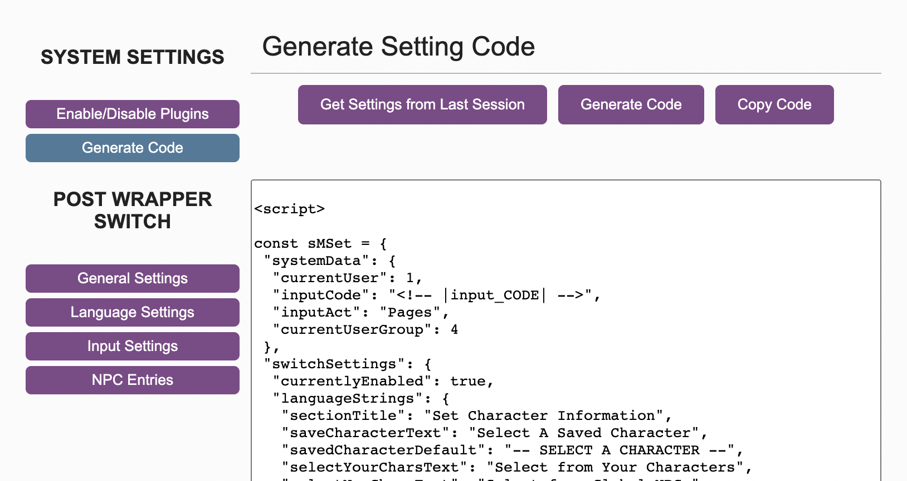

# Admin Guide

Welcome to the Administrator's guide to using the Scriptify system! This document will cover how to generate and save configuration settings for the base system. Guides for each plugin, and what their settings do, can be found in the plugin-specific documentation.

## In this guide

- [First Steps](#first-steps)
- [Configuring Modules](#configuring-modules)
- [Generating Settings](#generating-settings)
- [Saving Settings](#saving-settings)
- [Troubleshooting](#troubleshooting)

- ## First Steps

  Before you can generate and save settings, you will need to install the Scriptify codes and create an Administrator config page.

  Depending on the modules you are using, and what you would like your members to access, you may need to create a User config page as well. These steps are all outlined in the [Installation](./installing.md) guide.

- ## Configuring Modules

  - YouTube guide for this step

  When you first load your Admin config page, you will be taken to the "Enable/Disable Plugins" tab. Here, you can quickly toggle plugins on and off as you need. Disabling a plugin does not destroy the data related to it, so you can turn it back on whenever you need to.

  Each plugin will be listed with the enable/disable button to the right. Click the button to enable or disable the plugin as you require.

  Plugins that are in a disabled state will have a button to "Enable"
  

  Plugins that are in an enabled state will have a button to "Disable"
  

  When a plugin is Enabled, it's related settings will also be available in the left-hand sidebar.

- ## Generating settings

  - YouTube guide for this step

  Each plugin will come with its own settings to customise. Please see the relevant admin guide for each plugin to learn about specific plugin settings. You can find direct links to the admin guides of each plugin on the [Module List](./moduleList.md) page.

  - ### Getting your configuration code

    Once you have enabled and configured your plugins, you can generate the settings code.

    To do this, click the "Generate Code" button in the left-hand sidebar.
    

    To get a copy of your configuration code with all of the changes you have made to it, click "Generate Code". This will fill the textbox below with your updated code.

    

  - ### Retrieving a configuration code & autosaving

    Generating the code does **not** save your changes.

    There is a small auto-save feature that may save the day if your browser crashes unexpectedly, but it is not something to rely on. You can retrieve the last auto-saved version of your configuration code (if one exists) by clicking the "Get Settings From Last Session" button.

    The auto-save feature is triggered every time the tab is changed in the admin configuration page. While this may be useful, it is not reliable. The only reliable method of saving your settings is to follow the saving procedure below.

- ## Saving settings

  - YouTube guide for this step

  Once you have generated your plugin and system settings, the next step is to save them into your Jcink admin panel.

  - ### Copy your new configuration settings

    On the "Generate Code" tab of the admin configuration page, you will see a button on the right called "Copy Code".

    Click this to copy the contents of the text box into your computer's clipboard. A message will appear to let you know that the text has copied successfully. If your computer doesn't allow this function, you can copy it by highlighting all the text and pressing CTRL/CMD-C as normal.

  - ### Find your Scriptify settings webpage, and edit it

    In your JCink admin panel, navigate to the Webpage Maker and find the settings page you created as part of the [Installation](./installing.md) process. Click the 'edit' button on the right of screen to open the page editor.

  - ### Replace the old settings code with your new code

    Clear all of the code out of the webpage edit box.

    Paste in the new code that has been copied to your clipboard.

  - ### Save the webpage

    Click 'Edit Webpage' at the bottom of the screen.

    A message will appear above the 'Edit Webpage' button to let you know that the page has been saved successfully.

    Remember: Your new configuration settings will only work once this webpage has been successfully updated.

- ## Troubleshooting
  If you have followed all of these steps, but your code doesn't appear to be updating - or the system is not functioning at all, log an issue in this GitHub, or seek advice via Discord.

## More Resources:

- [Introduction](../README.md)
- [Installation](./installing.md)
- [Member Guide](./memberguide.md)
- [Module List](./moduleList.md)
