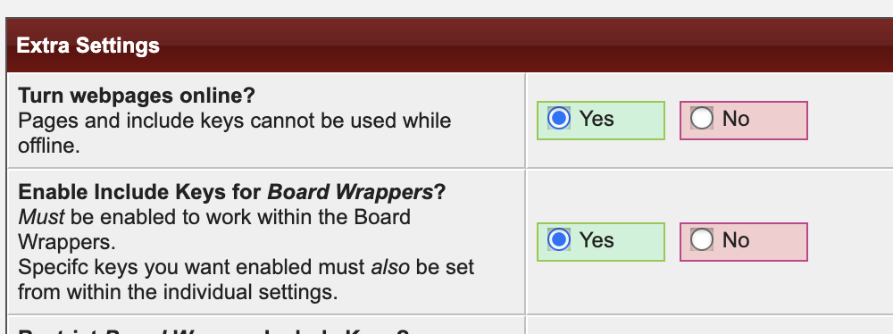

# Scriptify Documentation

## Introduction

Scriptify by SadriCodes is a user-friendly JavaScript plugin system for administrators of Jcink forum websites.

It allows users to enable and disable additional functions to be applied on the front end, and configuration pages for both admin and member use.

## Modules

- ### Post Wrapper Switch
  - [Post Wrapper Switch Guide](./wrapperSwitch.md)

## Installation

- ### Install Scriptify to a custom webpage

  - YouTube guide for this step

1. #### In your Jcink Forum Admin CP, create a new webpage

   - Select "Webpage Maker" from the "Skins & Templates" section of your Admin sidebar.
     
   - Select "Create new webpage" from the bar toward the bottom of the page.
     

     _IMPORTANT:_ You will need to have webpages turned _online_ and _enable include keys_.
     

   - Give your new page a Title, and an Include Key. Make sure that "Allow Use" in board wrappers is set to "Yes".
     

   - In a different tab, load the latest [Settings Template](../templates/settingsTemplate.html) here on GitHub.

   - Copy the raw contents of that file by clicking the copy icon to the left of the trashcan icon
     

   - Paste all of the copied code directly into the 'Contents' box for your new webpage.
     

   - Save your new webpage by clicking "Create Webpage" at the bottom of the screen.

2. #### Get the page include key, and add it to your board wrappers

   - Find your new webpage in the list of custom webpages
     

   - Highlight and copy the 'include key' for your new webpage.
     

- ### Create custom webpage for admin settings

  - YouTube guide for this step

  This is where we will describe creating the admin page.

- ### Create custom webpage for user settings

  - YouTube guide for this step

  This is where we will describe setting up the user page.

## Admin Guide

- ### Generating settings

  - YouTube guide for this step

  This is where we will describe how to create a settings code

- ### Saving settings

  - YouTube guide for this step

  This is where we will describe saving the settings in the ACP

## Member Guide

- ### Generating settings

  - YouTube guide for this step

  This is where we will describe how to create settings as a user

- ### Saving settings

  - YouTube guide for this step

  This is where we will describe how to save settings as a user

## Resources
