# Installation

There are three basic steps you need to take to install Scriptify:

- Install the Scriptify codes to your wrappers
- Create an admin configuration page
- Create a user configuration page (if required)

## Install Scriptify codes to your skin wrappers

- YouTube guide for this step

1. ### In your Jcink Forum Admin CP, create a new webpage

   1. Select "Webpage Maker" from the "Skins & Templates" section of your Admin sidebar.

   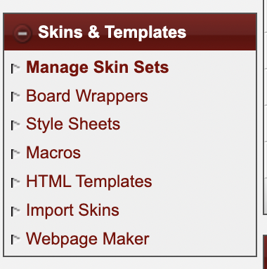

   2. Select "Create new webpage" from the bar toward the bottom of the page.

   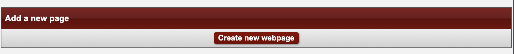

   _IMPORTANT:_ You will need to have webpages turned _online_ and _enable include keys_.

   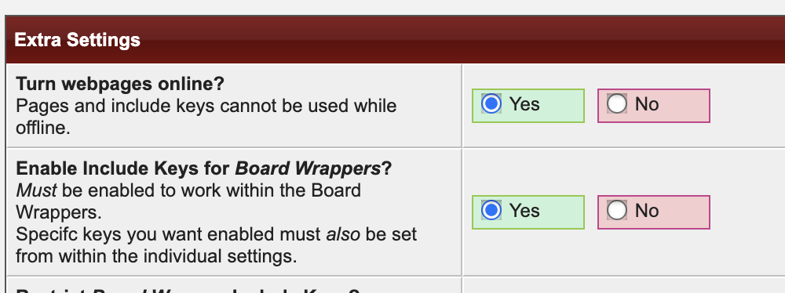

   3. Give your new page a Title, and an Include Key. Make sure that "Allow Use" in board wrappers is set to "Yes".

   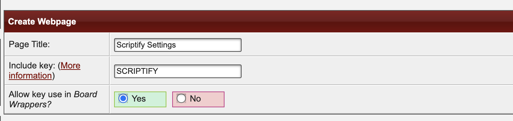

   4. In a different tab, load the latest [Settings Template](../templates/settingsTemplate.html) here on GitHub.

   5. Copy the raw contents of that file by clicking the copy icon to the left of the trashcan icon

   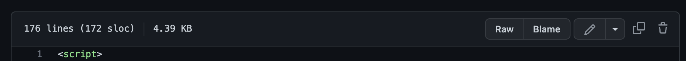

   6. Paste all of the copied code directly into the 'Contents' box for your new webpage.

   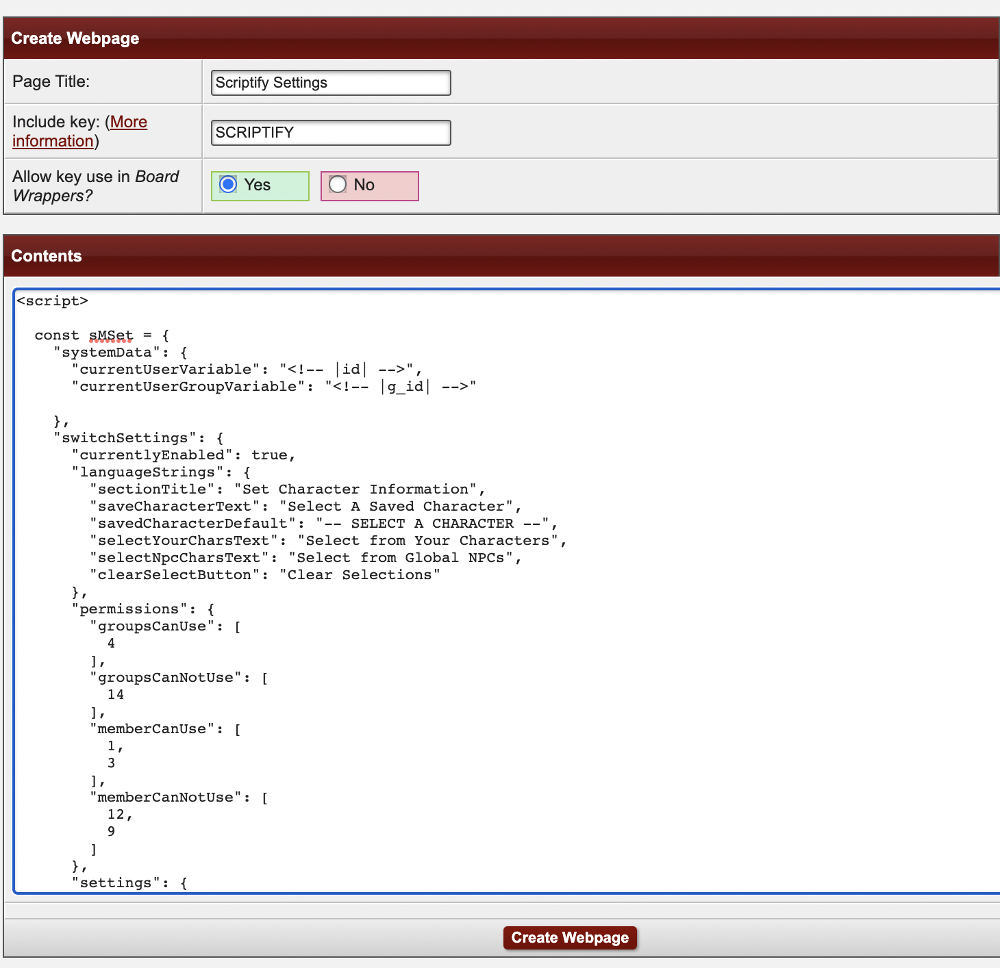

   7. Save your new webpage by clicking "Create Webpage" at the bottom of the screen.

2. ### Get the page include key, and add it to your board wrappers

- Find your new webpage in the list of custom webpages

  

- Highlight and copy the 'include key' for your new webpage.

  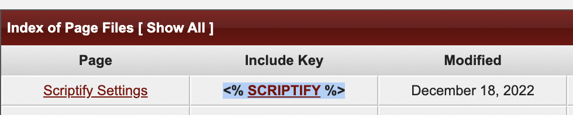

- Select "Board Wrappers" from the "Skins & Templates" section of your Admin sidebar.

- Click 'Edit' for the skin you would like to add Scriptify functionality to.

  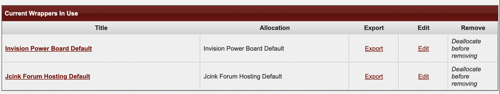

- Add the webpage includes key inside the <head> element of the wrappers, BELOW the <% JAVASCRIPT %> key

  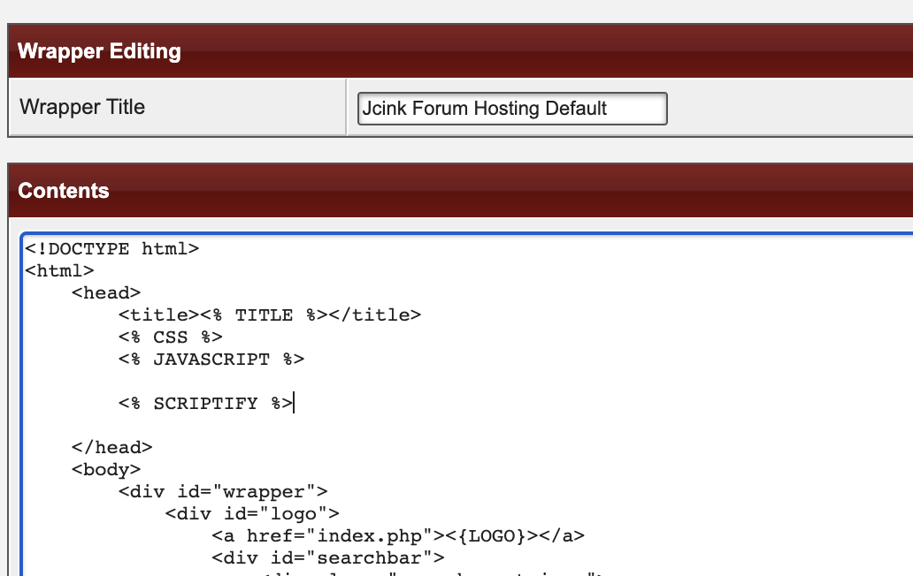

3. ### Add the Scriptify CDN link to the bottom of your board wrappers

- While still editing the board wrapper, scroll to the bottom of the wrapper code and paste the Scriptify code link directly before the </body> tag
  **SCRIPTIFY CODE LINK**

  ``

  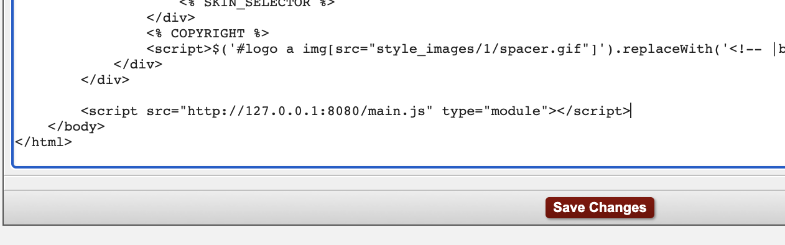

4. ### Add the Scriptify CSS to the wrappers

- Still on the board wrapper edit page, paste the following link BELOW the <% CSS %> key in the <head> section of the wrapper.

  `<link rel='stylesheet' href="http://127.0.0.1:8080/jcinkSwitch.css">`

5. ### Repeat steps 2-4 for the wrappers of any skins/themes you would like to add Scriptify functionality to.

## Create custom webpage for admin settings

- YouTube guide for this step

1. ### Create a new webpage and give it the name "Admin Settings".

- Follow the steps to create another new webpage, and call this one "Admin Settings"
  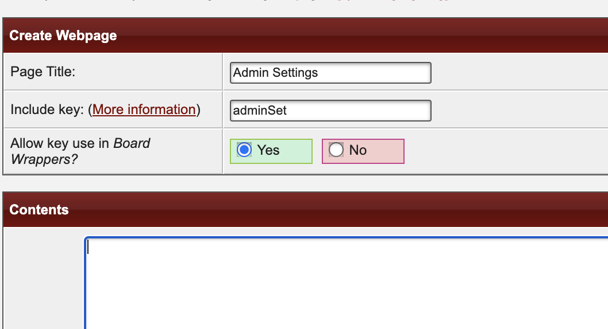

2. ### Paste the admin settings template code into the contents box, and save your webpage

- View the code for the latest [Admin Template](../templates/adminConfigTemplate.html) and copy it by clicking the copy icon to the left of the trash can

- Paste the copied code into the "Contents" section of the webpage you are creating. Save the webpage by clicking "Create Webpage".

3. ### Get the link for your admin configuration page, and view it in the browser

- Back on the 'Webpage Maker' page of your Admin CP, you will now see the new Admin Settings page listed.

- Click the name of the page to view it in the browser. If the page appears successfully, congratulations! You did it!

  You can use this link to send administrators directly to the configuration page.

  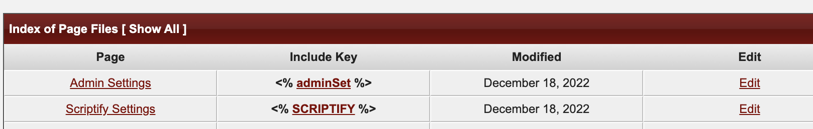

  Note that there aren't any permissions checks on the administrative page - but saving new configuration settings _does require_ ACP access.

- To begin customising the system and enabling modules, see the Admin Guide for more information.

## Create custom webpage for user settings

- YouTube guide for this step

- Note: You may not require a User Settings page if the modules you enable don't require custom user information, or if you disable certain aspects of modules (such as user character settings in Post Wrapper Switch).

  The user configuration system is designed to help non-coding members easily generate the code they need to add to their profiles.

1. ### Create a new webpage, and give it the name "User Settings"

- Follow the steps to create another new webpage, and call this one "User Settings"

2. ### Paste the user settings template code into the contents box, and save your webpage

- View the code for the latest copy of the [User Template](../templates/userConfigTemplate.html) and copy it by clicking the copy icon to the left of the trash can.

- Paste the copied code into the "Contents" section of the webpage you are creating. Save the webpage by clicking "Create Webpage".

  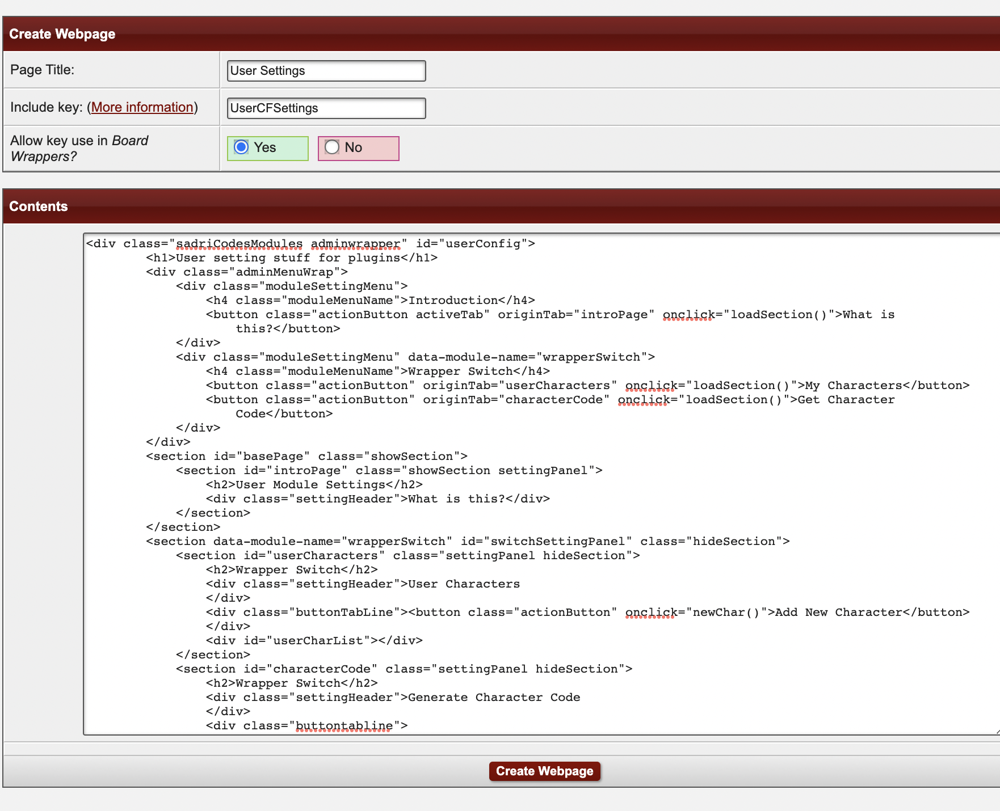

3. ### Get the link for the user configuration page, and view it in the browser

- Back on the 'Webpage Maker' page of your Admin CP, you will see the new User Settings page listed.

- Click the name of the page to view it in the browser. If the page appears successfully, give yourself a round of applause! You're awesome!

- To help users begin customising their information for the system, direct them to the Member Guide for more information.
