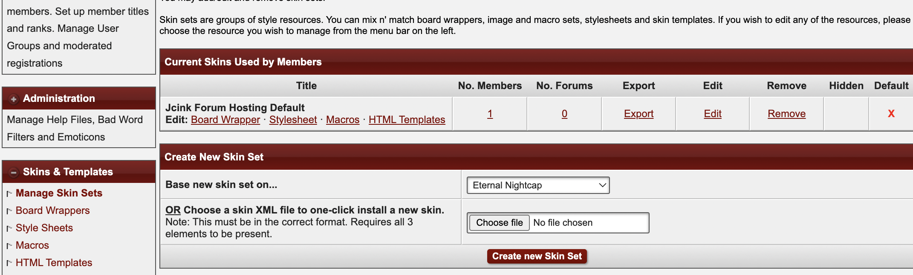
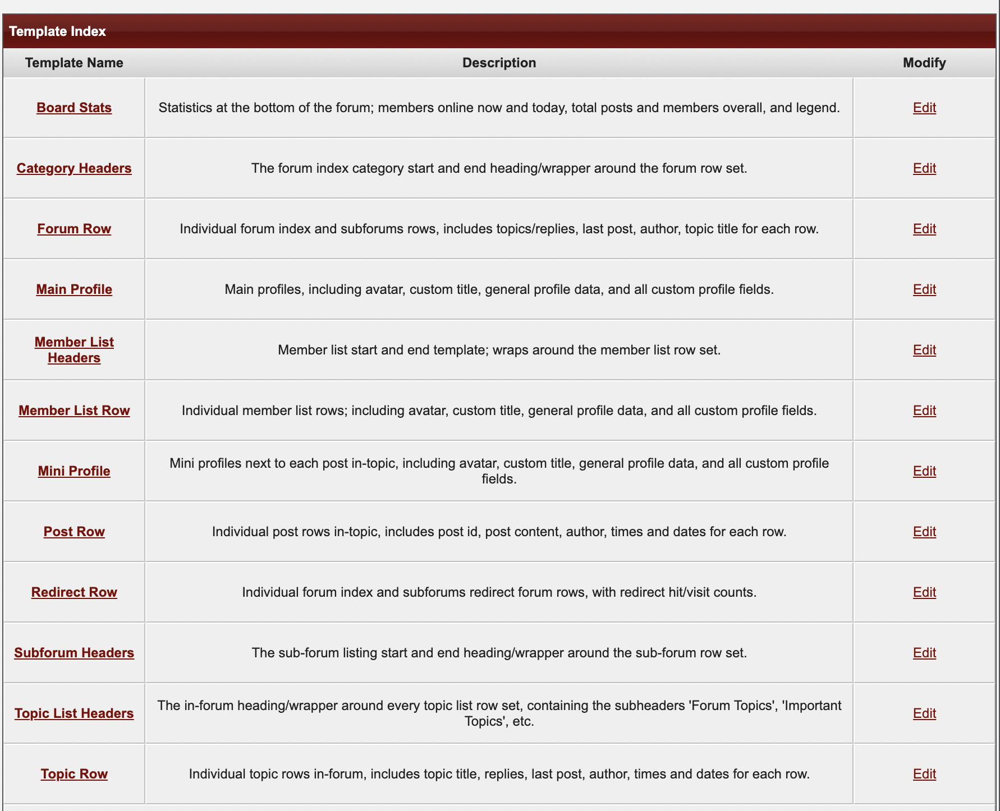
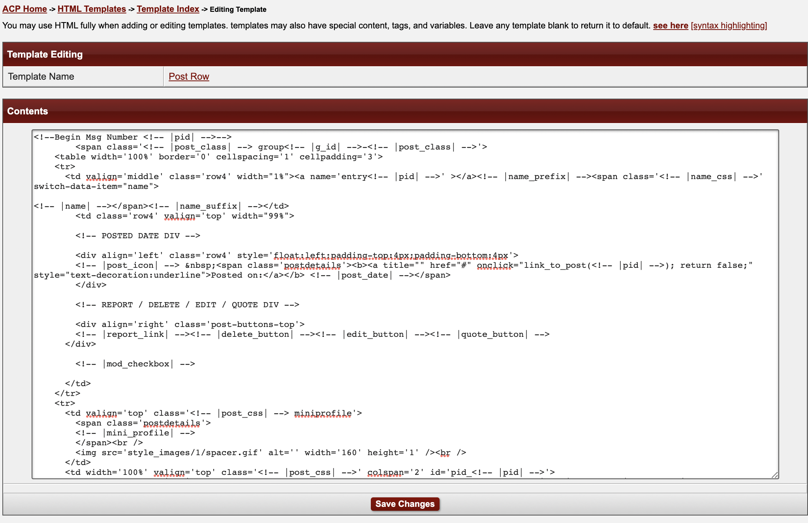
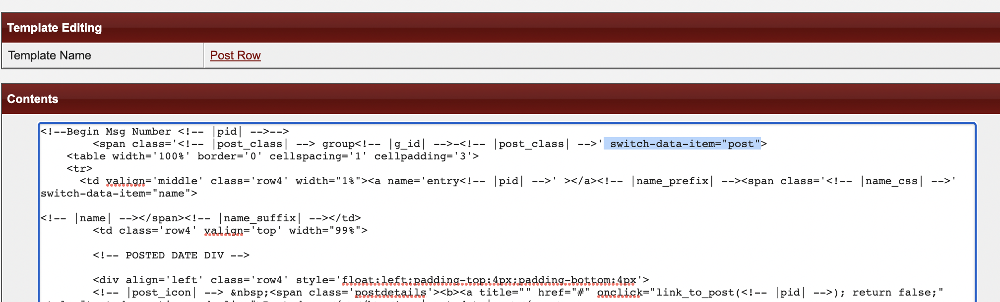

# Wrapper Switch for Administrators

Welcome to the Wrapper Switch guide for administrators! In this document, we will cover how to set up your post view for Wrapper Switch items, how to add and delete items, how to add and delete NPC characters, and how the permissions systems work.

This guide assumes that you have successfully installed the base codes and created configuration pages described in the [Installation](../../installing.md) documentation, and enabled/configured the Wrapper Switch plugin as described in the [Admin Guide](../../adminguide.md).

## Configuring Post Templates to use Wrapper Switch

- ### Add the data attribute to your whole post container

  - #### Find the Post Row HTML template to edit

    In your JCink Admin CP, click "Manage Skin Sets" to view a list of skins available on your forum.

    

    Click the 'HTML Templates' link for the skin you would like to modify.

    This will take you to the list of available HTML templates.

    

    In the example, we will be working with the "Jcink Forum Hosting Default".

    > > > When first installed, the Jcink Forum Hosting default skin does not have a set of templates assigned. If you would like to begin from this theme, you can create and allocate a set of templates as described in the [Jcink HTML Templates Documentation](https://jcink.com/main/wiki/jfh-html-templates). The code to use and edit for each template can be found on the [Default Templates](https://jcink.com/main/wiki/jfh-skinning-default-templates#category_list_header) page.

    Find the "Post Row" entry in the list of HTML templates, and click "Edit" to view the code.

    

    > > > If you don't see any code here, it may be because the theme is using default template code. Copy and paste the default template code from the [Default Templates](https://jcink.com/main/wiki/jfh-skinning-default-templates#category_list_header) page

  - #### Find the outermost container of your post template

    This is the HTML element that wraps around as much of the code as possible. This will be different from skin to skin, and if your theme has multiple post row display templates that are hidden/shown via CSS, there may be more than one. If you need help finding the element you're looking for, RP communities that have coding help available are the best place to seek help.

    In the case of the default Post Row template, the outermost container is a `` element. It's the element closest to the top that is not closed (there is no nearby `` tag associated with it, the closing tag can be found at the very bottom of the code)

  - #### Place the attribute in the opening tag of that container

    In the opening tag of that outermost container, add the following HTML attribute:

    `switch-data-item="post"`

    Sometimes these can be hard to read (especially if they have Jcink variables contained in them, like the example we're using), so it may be easiest to locate the end `>` for that tag and place the attribute code just before that.

    

- ### Add the data attribute to your post text container

## Add switch items to the post template

- ### Adding the name switch
- ### Adding the avatar switch
- ### Adding a new switch element

## General Wrapper Switch settings

## Wrapper Switch system permissions

## Wrapper Switch Language Settings

## Wrapper Switch Input Settings

- ### Creating a new input
- ### Editing an existing input
- ### Deleting an input

## Wrapper Switch NPC Settings

- ### Creating a new NPC
- ### Editing an existing NPC
- ### NPC permissions
- ### Deleting an NPC

## Menu

- [Documentation Index](../../../README.md)
- [Module List](../../moduleList.md)
- [Wrapper Switch User Guide](../wrapperSwitch/wrapperSwitchUser.md)
