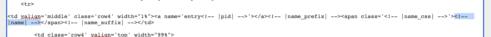
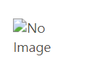

# Wrapper Switch for Administrators

Welcome to the Wrapper Switch guide for administrators! In this document, we will cover how to set up your post view for Wrapper Switch items, how to add and delete items, how to add and delete NPC characters, and how the permissions systems work.

This guide assumes that you have successfully installed the base codes and created configuration pages described in the [Installation](../../installing.md) documentation, and enabled/configured the Wrapper Switch plugin as described in the [Admin Guide](../../adminguide.md).

## Configuring Post Templates to use Wrapper Switch

- ### Add the data attribute to your whole post container

  - #### Find the Post Row HTML template to edit

    In your JCink Admin CP, click "Manage Skin Sets" to view a list of skins available on your forum.

    

    Click the 'HTML Templates' link for the skin you would like to modify.

    This will take you to the list of available HTML templates.

    

    In the example, we will be working with the "Jcink Forum Hosting Default".

    > > > When first installed, the Jcink Forum Hosting default skin does not have a set of templates assigned. If you would like to begin from this theme, you can create and allocate a set of templates as described in the [Jcink HTML Templates Documentation](https://jcink.com/main/wiki/jfh-html-templates). The code to use and edit for each template can be found on the [Default Templates](https://jcink.com/main/wiki/jfh-skinning-default-templates#category_list_header) page.

    Find the "Post Row" entry in the list of HTML templates, and click "Edit" to view the code.

    

    > > > If you don't see any code here, it may be because the theme is using default template code. Copy and paste the default template code from the [Default Templates](https://jcink.com/main/wiki/jfh-skinning-default-templates#category_list_header) page

  - #### Find the outermost container of your post template

    This is the HTML element that wraps around as much of the code as possible. This will be different from skin to skin, and if your theme has multiple post row display templates that are hidden/shown via CSS, there may be more than one. If you need help finding the element you're looking for, RP communities that have coding help available are the best place to seek help.

    In the case of the default Post Row template, the outermost container is a `` element. It's the element closest to the top that is not closed (there is no nearby `` tag associated with it, the closing tag can be found at the very bottom of the code)

  - #### Place the attribute in the opening tag of that container

    In the opening tag of that outermost container, add the following HTML attribute:

    `switch-data-item="post"`

    Sometimes these can be hard to read (especially if they have Jcink variables contained in them, like the example we're using), so it may be easiest to locate the end `>` for that tag and place the attribute code just before that.

    

  - #### Save the HTML template

    Click the 'Save Changes' button to save your changes. A message will appear above the button with the time the template was successfully saved.

- ### Add the data attribute to your post text container

  - #### Open the "Post Row" HTML template to edit

    As described in the first step, locate and open the "Post Row" template for the skin you would like to modify.

  - #### Find the container that wraps around the post text

    This can be tricky to identify, especially in custom skins.

    Look for the `<!-- |post| -->` Jcink variable located in the template. This is where the post text will be loaded.

    Now, have a look at the HTML element that comes directly before it. If that element opens before that variable, and closes after it - that's likely the one you're looking for! Again, Jcink RP community coders can be a great help in finding the correct post container element.

    In the default template, the post container element looks like this:

    

  - #### Add the Post Text attribute to this container

    Similar to how you did with the outermost container, place this attribute into the post container element's opening tag:

    `switch-data-item="postText"`

    The updated code for the default example looks like this:

    

  - #### Save the HTML template

    Click the 'Save Changes' button to save your changes. A message will appear above the button with the time the template was successfully saved.

Congratulations! Your post template is now set up and ready to add your switch elements!

## Add switch items to the post template

Now that we have the post container set up, we can start adding elements that we want to be switched using the code. Character names and avatars are two common elements, but this guide will also cover how to add generic text and image elements of your choice.

- ### Adding the name switch

  To switch the account name, Wrapper Switch changes the innerText property of an element. To make it work, we just need to tell it what HTML element in the template needs to be changed.

  - #### Open up the Post Row HTML template for editing

    Detailed steps for this can be found above if you need them.

    The Post Row template usually contains the name of the account that is posting, so we need to tell the Wrapper Switch code where to find what it needs to switch out.

  - #### Locate the account name variable in the template

    The Jcink Post Row variable for the account name is `<!-- |name| -->`, and it's usually surrounded by a few other variables like the prefix and suffix, as well as the name_css.

    In the default template, it looks like this:

    

    It looks a bit confusing, so let's add some line breaks and indents to make it easier to read:

    

    This is the same code as before -- just with a bit of formatting. If you're using a custom theme with a custom post row template, the code will be very different to this, but it will always contain that name variable.

  - #### Get the name attribute code from your Admin Configuration Page

    In another tab, load your Admin Configuration page. If you have the Wrapper Switch module enabled (see the [Admin Guide](../../adminguide.md) page for help enabling/disabling plugins), you will see settings tabs for the Wrapper Switch plugin in the left-hand sidebar.

    Select the "Input Settings" tab

    

    Here you can see a list of all the available inputs you have configured.

    Underneath the 'Character Name' heading, you can see a code box. Click the 'Copy Code' button to the right of this box to easily copy the code to your clipboard, or highlight and copy with your normal preferred method if your browser doesn't allow script copying.

    If a message confirming that the code was successfully copied to your clipboard appears, you're good to go!

  - #### Add the attribute code to the element that contains the name variable

    Go back to where you were editing the Post Row template in your Admin CP.

    Find the element that wraps around the name variable. In the default theme, it's a span element.

    Add the attribute code we copied above to the end of that element's opening tag.

    

  - #### Save the Post Row template - that's done!

    Save the template, and have a stretch. Well done!

    You can test whether the switch is working by making a post and filling out the 'name' field in the post screen. When you view the post, it should change to the name you selected in the post screen.

    If not, check:

    - That the Wrapper Switch system is enabled
    - That the correct attributes have been added to the post row container, and the post text container (see above for instructions) - remember to check for typos!
    - That the name attribute has been inserted into the right place, and doesn't contain typos.

- ### Adding the avatar switch

  To switch out the avatar, Wrapper Switch changes the image source of an element. To make it work, we just need to tell it what HTML element in the template needs to be changed.

  - #### Open up the Mini Profile HTML template for editing

    The user avatar is usually loaded in the "Mini Profile" template. Follow the steps as if you were opening the Post Row template, but click the edit button next to "Mini Profile" instead.

  - #### Find the avatar variable

    This step may vary depending on how the mini profile has been coded. The default Jcink avatar variable looks like this:

    `<!-- |avatar| -->`

    This variable renders the complete HTML element, which wasn't very flexible for coders. To get around that, the avatar_url variable was also introduced and looks like this:

    `<!-- |avatar_url| -->`

    You will find the avatar_url used in two distinct ways:

    - as the `src` in an `` tag: `">`
    - in a style attribute for the avatar container: `
)>`

    > > > Currently, Wrapper Switch can only change avatars in `` tags, using the `src` attribute. Support to add CSS items and change background images in inline-CSS is planned, but not yet available.

  - #### If the variable is `<!-- |avatar| -->`

    In this case, we need to replace the variable entirely - that way we can modify the `` tag directly.

    Delete the variable from the template, and in it's place put the following code:

    ``

    Save the Mini Profile template, that's the avatar switch set up!

  - #### If the variable is `<!-- |avatar_url| -->`

    Here, we just need to add the attribute to the `img` tag. In the `img` tag where the variable is used, add the following attribute to the tag:

    `switch-data-item="avatar"`

    A very basic example would look like this:

    `" switch-data-item="avatar">`

    Save the Mini Profile template, you're good to go!

- ### Adding a new text switch element

  So far, we've set up switch elements for items that already exist. But what about those that don't? Text switch elements give you the ability to change the inner text of an item to a custom value.

  You might use this for changing custom field values or statuses that can change per post.

  - #### Load the Post Row or Mini Profile HTML template for editing

    The template you need will depend on where you want the information to display. If you need help finding the right template, the RP coding community will be able to help.

  - #### Find the attribute code for the item you want to add

    Go to the 'Input Settings' tab on your Admin Configuration page, and find the input that you would like to add to the template. Click 'Copy Code' or highlight and copy the code text as normal.

  - #### Add an element to contain the text

    In the template, add a HTML element where you want the text to display.

    This can be any HTML element that can display text - `span` and `div` will be the most common. A basic example would look like this:

    ``

    It looks a bit strange with nothing inside it - Wrapper Switch will use JavaScript to insert text into that element when it's required.

  - #### Add the attribute code to your new element

    Just as we did with other examples, add the attribute code to the opening tag of the element. It should look a bit like this:

    ``

    You can style this element however you like, add CSS classes and make it pretty. All that matters is that the attribute remains in that opening tag.

  - #### Save and close the template
    Save the changes to the template, and give it a test!

- ### Adding a new image switch element

  Image elements allow you to add additional images to your post view that change according to character information set up in Wrapper Switch. To make sure you don't end up with broken image links, it's recommended to set up a fallback image that will display if nothing else is set.

  - #### Load the Post Row or Mini Profile HTML template for editing

    The template you need will depend on where you want the information to display. If you need help finding the right template, the RP coding community will be able to help.

  - #### Find the attribute code for the item you want to add

    Go to the 'Input Settings' tab on your Admin Configuration page, and find the input that you would like to add to the template. Click 'Copy Code' or highlight and copy the code text as normal.

  - #### Add an element to contain the text

    In the template, add an `img` element where you want the text to display.

    A basic example would look like this:

    ``

    The fallback image URL is important.

    It may be a "default" image you want to display if a link is not supplied by the user, or it could be a small transparent png to give the illusion of nothing displaying at all. If there is no fallback image and your user does not supply an image URL, your posts will show broken image icons instead. Look how sad they are:

    

    Avoid sadness, and provide a fallback image URL.

  - #### Add the attribute code to your new img element

    Just as we did with other examples, add the attribute code to the opening tag of the element. It should look a bit like this:

    ``

    You can style this image container however you like, add CSS classes and make it pretty. All that matters is that the attribute remains in that tag.

  - #### Save and close the template
    Save the changes to the template, and give it a test!

## General Wrapper Switch settings

In the Admin Configuration page, you can define how Wrapper Switch behaves - and who has access to it!

Remember when you change settings here, you need to regenerate your configuration code and save it into the Jcink ACP as detailed in the [Admin Guide](../../adminguide.md).

- ### Wrapper Switch Features

  This section is for simple on/off options and can be found on the 'General Settings' tab of the Post Wrapper Switch section of the left-hand sidebar on your Admin Configuration page. You can tick, or un-tick these options as required. Options include:

  - User Characters Allowed
    Choose whether members can create and save characters to their user profiles, ready to use in the posting screen

  - NPC Characters Allowed
    Choose whether NPC characters set up via the Admin Configuration page will be available for use in the posting screen

  - Show Post Screen Inputs
    Choose whether Wrapper Switch text boxes will display in the posting screen, allowing members to define new characters and change character information per post.

  - Show User Character Dropdown
    Choose whether the dropdown for a user's characters is visible in the posting screen.

  

- ### Custom Field Variable

  If you are allowing users to create their own charaacters and save them into their profiles, you will need to create a custom field for them to save their configuration code into.

  Then, enter the custom field number into this setting to ensure Wrapper Switch knows where to look for user character information.

  

## Wrapper Switch system permissions

This section determines what members/groups do and do not have access to Wrapper Switch functionality, and can be found on the 'General Settings' tab of the Post Wrapper Switch section of the left-hand sidebar on your Admin Configuration page.

- ### Understanding permissions

  Permissions for the overall system are divided into Group Permissions, and Member Permissions.

  Group Permissions allow you to set a blanket rule for a member group, while Member Permissions allow you to override those rules for particular members. The permissions lists work as follows:

  - Member groups that can use the switch system

    All members of this group can use the Wrapper Switch system, UNLESS they are excluded in member permissions.

  - Member groups that can NOT use the switch system

    No members of this group can use the system, UNLESS they are included in member permissions.

  - Members that can use the switch system

    These members can ALWAYS use the switch system, even if their group is excluded.

  - Members that cannot use the switch system

    These members can NEVER use the switch system, even if their group is included.

  Member-based permissions will always override group-based permissions.

- ### Changing permission lists

  Enter the group number, or member id number, into the input box of the permission division you would like to modify.

  Click "Add" to include that member or group in the list.

  To remove a member or group from the list, click the number in the box. An alert will appear to confirm that you want to remove that member id or group number from the list.

  

## Wrapper Switch Language Settings

This section allows you to change the wording of text used by the plugin, and can be found on the 'Language Settings' tab of the Post Wrapper Switch section of the left-hand sidebar on your Admin Configuration page.

Simply click inside the input boxes and change the text as you need, remembering to regenerate your configuration code and save it to your Jcink Admin CP.

## Wrapper Switch Input Settings

The Input Settings section is where you can manage all of your switchable items, add new items, edit existing ones, get attribute codes, and delete items as required, and can be found on the 'Input Settings' tab of the Post Wrapper Switch section of the left-hand sidebar on your Admin Configuration page.

![Input Settings page in Admin Config page]

- ### Creating a new input

  To create a new input, click the 'Add New Input' button at the bottom of the page. An entry called 'New Field' will appear at the bottom of the list.

  

  Click the 'show' button for "New Field" to view the field options.

  

  Fill out the details of the new input:

  - Field Name is the name of the new input
  - Field ID is a unique ID for the input (no spaces)
  - Field Code is a reference code for the input (no spaces)
  - Field Order determines where this field will display on the posting screen, and also on your input settings list
  - Field Required determines whether members MUST enter a value in this field when using the Post Switch

  Regenerate your configuration code and save it to your Jcink Admin CP to save the new input.

- ### Editing an existing input

  To edit an input that already exists, click the 'show' button for the field you would like to modify.

  Change input information as you need, remembering ID and Code cannot have spaces.

  Regenerate your configuration code and save it to your Jcink Admin CP to save the changes to this input.

- ### Deleting an input

  To delete an input, click the "Delete" button below the input item listing.

  An alert box will confirm whether you would like to delete that item. Click 'OK' to continue, or 'Cancel' to cancel the action.

  Regenerate your configuration code and save it to your Jcink Admin CP to permanently remove the input.

## Wrapper Switch NPC Entries

The NPC Entries section is where you can manage all of your global NPCs, add new ones, edit existing ones, and change who has access to them. This section can be found on the 'NPC Entries' tab of the Post Wrapper Switch section of the left-hand sidebar on your Admin Configuration page.

- ### Creating a new NPC

  To create a new NPC, click the 'Add New NPC' button at the bottom of the page. This will create an entry called 'New Character' at the bottom of the list.

  

  Click the 'Edit' button to the right of the name to view NPC information.

  

  The fields you see here will depend on what inputs you have set up, but some are required for all characters:

  - Character Name
  - Shortcode (one is auto-generated, but you can change this to something else unique)
  - Order (what order this NPC should display in drop-down lists and the NPC entry list)
  - Description (a small description of the NPC, shown on the NPC entry list)

  When you've finished filling out the character information, regenerate your configuration code and save it to your Jcink Admin CP to save the NPC.

- ### Editing an existing NPC

  Click the 'Edit' button to the right of the name of the NPC you would like to edit to view NPC information.

  Change information as required, remembering that shortcodes must be unique.

  When you've finished modifying character information, regenerate your configuration code and save it to your Jcink Admin CP to save the NPC.

- ### NPC permissions

  Each NPC has their own permissions, allowing you to determine which members are allowed to post with each global NPC.

  Permission type for NPCs can either be set to "Include All Members" or "Exclude All Members". When the permission type is selected, the title of the permission list boxes changes.

  - Include All Members means that any group or member numbers in the "Groups CAN Use" or "Members CAN Use" lists have the ability to post with this character, UNLESS their member number is shown in the 'Member CAN NEVER use" list.

  Permissions set with 'Include All Members' may look like this:

  

  - Exclude All Members means that that any group or member numbers in the "Groups CAN NOT Use" or "Members CAN NOT Use" lists do NOT have the ability to post with this character, UNLESS their member number is shown in the 'Member CAN ALWAYS use" list.

  Permissions set with 'Exclude All Members may look like this:

  

  #### Changing NPC permissions

  To add a member group number, or member id number to a permissions list, enter the number into the text box and click 'Add'.

  To remove a member group numer, or member id number from a permissions list, click the desired number in the box. An alert will confirm whether to continue with removing the item.

  When you've finished modifying NPC permissions, regenerate your configuration code and save it to your Jcink Admin CP to save the NPC.

- ### Deleting an NPC

  To delete an NPC, simply click the "Delete (character name)" button at the bottom-right of the NPC's listing.

  An alert will confirm whether to continue with removing the NPC from the list.

  Regenerate your configuration code and save it to your Jcink Admin CP to save the updated NPC list.

## Menu

- [Documentation Index](../../../README.md)
- [Module List](../../moduleList.md)
- [Wrapper Switch User Guide](../wrapperSwitch/wrapperSwitchUser.md)
